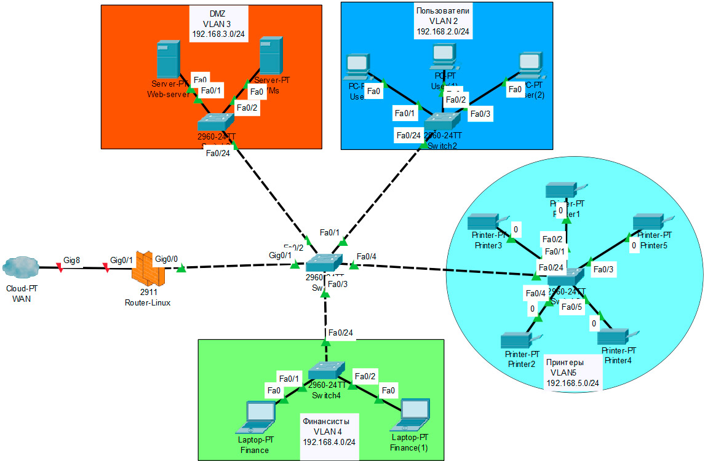

# 1. Парсинг логов

Есть несколько вариантов решения данной задачи:
1. Небольшой Python скрипт, который построчно разбирает лог Web-сервера по необходимым критериям
    ```python
    import re

    def parser(file):
        
        ip = {}
        with open(file, 'r') as f:
            for line in f:
                a = re.split('(?<=["\d]) (?=["\d])', line)
                if 'profi.ru' == a[1].strip('"') and 'GET /remont/santehnika' in a[7]:
                    ip[a[3].strip('"')] = (ip[a[3].strip('"')] + 1) if a[3].strip('"') in ip else 1
        ip = sorted(ip.items(), key=lambda i: i[1], reverse=True)

        print(ip[:10])
        

    parser('./nginx.log')
    ```

2. Можно воспользоваться готовыми системами по централизованному хранению и обработке логов `ELK`, `GrayLog`, `Fluentd` и т.п. И использовать их возможности для разбора и фильтрации журналов по набору различных параметров.

3. Загрузить файл логов в СУБД (например PostgreSQL, MySQL), по принципу копирования CSV файла (где разделитель - пробельный символ, ограничитель строки - двойные кавычки) и применить операторы условий, группировки и агрегатные функции. Как пример:

    ```SQL
    SELECT col4, COUNT(col4) AS QuantityGET FROM logs
    WHERE col2 = 'profi.ru' AND col8 LIKE 'GET /remont/santehnika%'
    GROUP BY col4
    ORDER BY QuantityGET DESC
    LIMIT 10
    ```

# 2. Настройка сети с "Демилитаризованной Зоной"(DMZ)

1. `Предположительно`, для организации сети с DMZ как в Задании, необходимо как минимум `4 подсети`, разделенные при помощи технологии VLAN.  
Вот пример логической схемы:

    

    Здесь первоначально необходимо проделать на всех сетевых устройствах следующее:

    1. Создать на каждом коммутаторе свои `VLAN`;
    1. Настроить теггированные и нетеггированные порты (`Trunk/Access`) на каждом коммутаторе;
    1. На центральном коммутаторе перевести порты смотрящие в сторону VLAN'ов в режим Trunk. При этом на интерфейсе Fa0/3, смотрящем в сторону VLAN 4, исключить из Trunk `VLAN 2`, чтобы пользователи из VLAN 2 не могли обнаруживать финансистов из VLAN 4 на канальном уровне;
    1. На Маршрутизаторе (Router-Linux) создать VLan`ы c идентификаторами такими же, как мы задали на коммутаторах (2,3,4,5);
    1. Настроить на Router-Linux `DHCP-пулы` для каждой подсети, чтобы выдавать сетевые настройки автоматически всем оконечным устройствам;
    1. Чтобы начать маршрутизировать трафик между VLAN\`ами необходимо создать виртуальные интерфейсы `Gig0/0.2`, `Gig0/0.3`, `Gig0/0.4`, `Gig0/0.5` (над физическим `Gig0/0`) на маршрутизаторе для каждого VLAN и присвоить им первые адреса из каждой подсети 192.168.2.1/24, 192.168.3.1/24, 192.168.4.1/24, 192.168.5.1/24 соответсвенно

    > Если используется сервер с Linux в качестве маршрутизатора, то настройки можно производить через `NetPlan` - Debian, либо пользоваться средствами `systemd-networkd` - Arch или `ifupdown` - другие).

    В итоге , мы получим `4 подсети`, для каждого подразделения.

1. Предположим, что в качестве маршрутизатора у нас выступает Сервер с настроенной для приёма/передачи пакетов ОС Linux (напр. Ubuntu-server).
    
    Представим, что описанные выше действия, как например создание виртуальных интерфейсов и VLAN, настройка DHCP, всё это провели в Linux, например возможностями утилиты `NetPlan` и сервера `ISC-DHCP`.

    В итоге мы получили следующие интерфесы (не берём в расчёт схему именования интерфейсов в Linux - `ifnames`, представим, что названия мы задали вручную):
    
    - `gig0/1` – интерфейс с общедоступным адрессом 202.54.1.10, направленный в сторону `WAN`;
    - `gig0/0.2` – виртуальный интерфейс с частным адрессом 192.168.2.1, направленный в сторону `VLAN 2` (Users);
    - `gig0/0.3` – виртуальный интерфейс с частным адрессом 192.168.3.1, направленный в сторону `VLAN 3` (DMZ);
    - `gig0/0.4` – виртуальный интерфейс с частным адрессом 192.168.4.1, направленный в сторону `VLAN 4` (Finance);
    - `gig0/0.5` – виртуальный интерфейс с частным адрессом 192.168.5.1, направленный в сторону `VLAN 5` (Printers);

    Включим переадресацию IP в ядре Linux (в /etc/sysctl.conf поменяем директиву `net.ipv4.ip_forward = 1`)

    Тогда можно воспользоваться возможностями встроенного в ядро Linux FireWall\`а — `Netfilter`, а именно возможностями утилиты `iptables` для настройки сетевого экрана.

    Итак, по условиям Задания нам необходимо, чтобы были выполнены следующие условия:
    - К Web-серверу 192.168.3.2 в DMZ разрешён доступ из внешней сети;
    - Внутренним узлам (Пользователи) разрешен доступ в интернет и к узлам VM DMZ по SSH (порт 22);
    - Финансистам доступ к Принтерам и в глобальную сеть;
    - К узлам сети Финансистов нет доступа из сети Пользователей;
    - Принтеры должны быть доступны всем;

    ```sh
    # Запрещаем прохождение всех пакетов в цепочках INPUT/FORWARD таблицы filter (нормально закрытый брандмауер), но разрешаем по умолчанию все исходящие OUTPUT
    iptables -P INPUT DROP
    iptables -P FORWARD DROP
    iptables -P OUTPUT ACCEPT
    
    # Разрешаем DHCP-запросы к маршрутизатору
    iptables -A INPUT -i gig0/0.2, gig0/0.3, gig0/0.4, gig0/0.5 -p udp --dport 67 -j ACCEPT 

    # Разрешаем передачу пакетов через петлевой интерфейс для локальных процессов
    iptables -A INPUT -i lo -j ACCEPT

    # Перенаправляем все пакеты пришедшие из WAN на порты :80 или :443 на Web-сервер в DMZ
    iptables -t nat -A PREROUTING -i gig0/1 -p tcp -m multiport --dports 80, 443 -j DNAT --to-destination 192.168.3.2

    # Разрешаем проходить пакетам в/из интернет(а) с интерфейса gig0/0.2 (Users)
    iptables -A FORWARD -i gig0/0.2 -o gig0/1 -j ACCEPT
    iptables -A FORWARD -i gig0/1 -o gig0/0.2 -m state --state ESTABLISHED,RELATED -j ACCEPT

    # Разрешаем подключения по SSH
    iptables -A FORWARD -i gig0/0.2 -o gig0/0.3 --dport 22 -j ACCEPT
    iptables -A FORWARD -i gig0/0.3 -o gig0/0.2 -m state --state ESTABLISHED,RELATED -j ACCEPT

    # Разрешаем проходить пакетам в/из интернет(а) с интерфейса gig0/0.4 (Finance)
    iptables -A FORWARD -i gig0/0.4 -o gig0/1 -j ACCEPT
    iptables -A FORWARD -i gig0/1 -o gig0/0.4 -m state --state ESTABLISHED,RELATED -j ACCEPT

    # Разрешаем проходить пакетам в/из gig0/0.5 (Printers)
    iptables -A FORWARD -i gig0/0.2, gig0/0.4 -o gig0/0.5 -j ACCEPT
    iptables -A FORWARD -i gig0/0.5 -o gig0/0.2, gig0/0.4 -m state --state ESTABLISHED,RELATED -j ACCEPT

    # Выполняем "маскирование" (замена адреса отправителя) пакетов, исходящих с интерфейса gig0/1
    iptables -t nat -A POSTROUTING -o gig0/1 -j MASQUERADE
    ```

# 3. Настройка Linux + MySQL + PHP стека

1. Поднимаем два Docker контейнера с образами MySQL и PHP

    ```YAML
    # Пример docker-compose
    version: '3.8'

    services:

        #PHP
        php:
            build: images/php
            image: php:8-alpine
            container_name: php
            restart: unless-stopped
            volumes:
                - ./app:/app
            user: 1000:1000
            ports:
                - 8080:8080
                - 8888:8888
            depends_on:
                - mysql
            
        # MYSQL
        mysql:
            image: mysql:latest
            container_name: mysql
            restart: unless-stopped
            volumes:
                - ./applications/mysql/data:/var/lib/mysql
                - ./applications/mysql/conf.d:/etc/mysql/conf.d
            ports:
                - 3306:3306
            env_file:
                - ./env/mysql/global.env
    ```
1. BackUP
    1. `Backup MySQL` можно организовать несколькими способами:
        1. Периодическое копирование файлов (например через `rsync`)
        2. Если настроены файловые системы `BTRFS` или `ZFS`, а также `LVM` можно настроить снимки – `снэпшоты`
        3. Копирование через SQL (напр. `MySQLdump`)
        4. Воспользоваться системой `Репликаций`

    1. `Backup` проекта на `PHP`:
        1. Периодическое копирование src файлов проекта (например через `rsync`)
        2. Использование систем контроля версий (`Git`)

1. Системы мониторинга можно организовать при помощи различных систем (`Zabbix`, `Prometeus` и т.д)

В Zabbix предусмотрены `Шаблоны` позволяющие производить сбор метрик MySQL (колличество подключений, количество ошибок подключения, время безотказной работы и т.д). Аналогично для процессов PHP.


